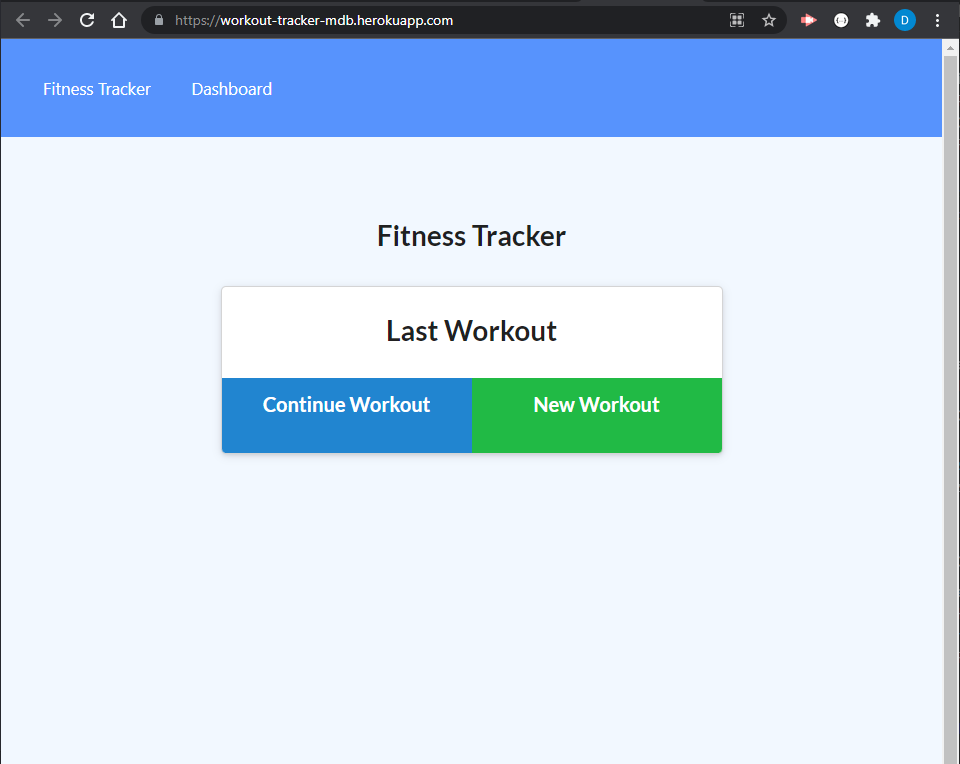
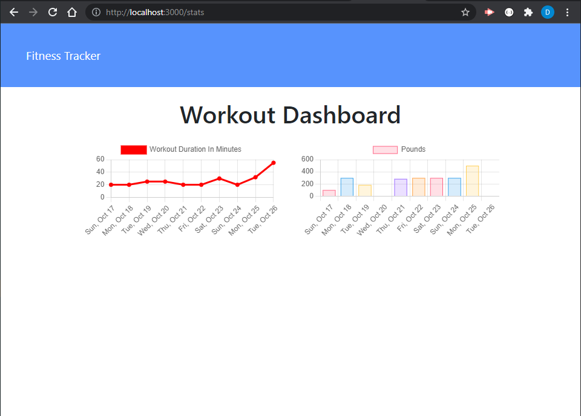
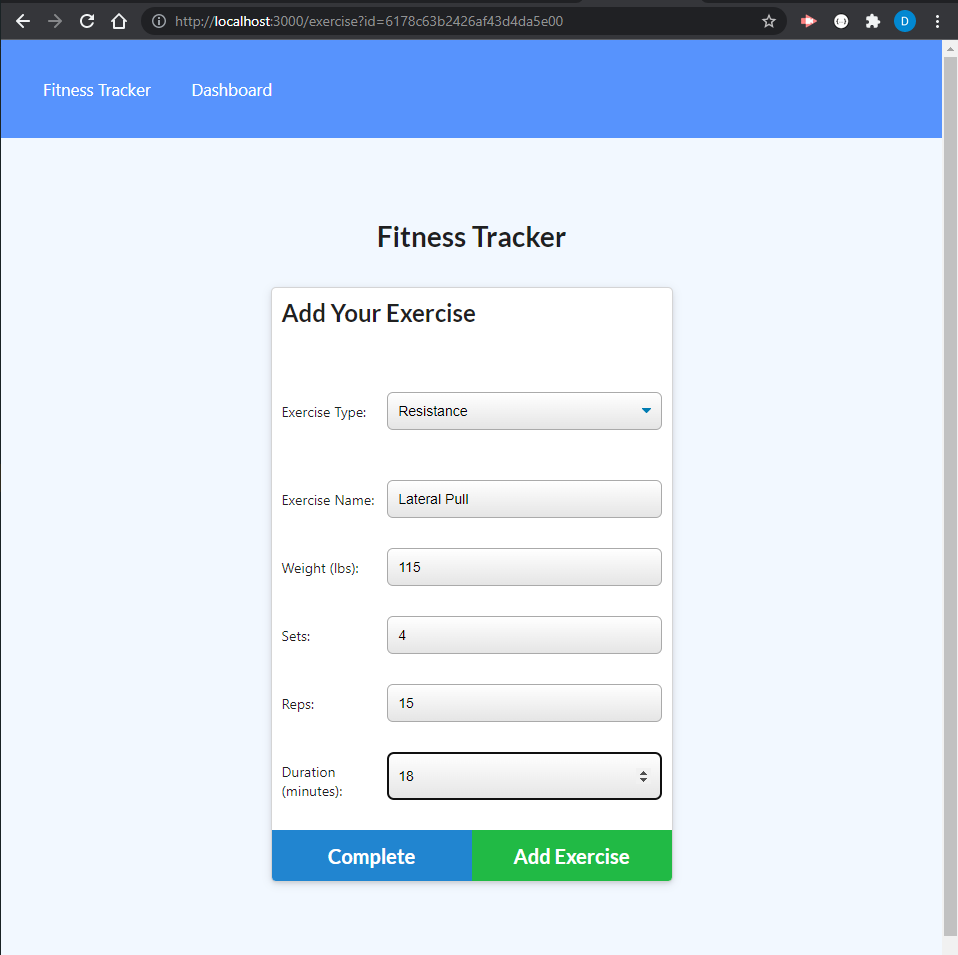

# Workout Tracker

With this application one can view, create and track daily workouts. One can log multiple exercises in a workout on a given day by tracking the name, type, weight, sets, reps, and duration of exercise. Cardio exercise is tracked one's distance traveled.

Reach fitness goals more quickly by tracking one's workout progress!

## Table of Contents

-[Link](#link)

-[Screenshot](#screenshot)

-[Technologies-Used](#technologies-used)

-[Contributions](#contributions)

-[Credits](#credits)

-[Questions](#questions)

## Link

[Check out this App here!](https://workout-tracker-mdb.herokuapp.com)

## Screenshot

 

## Technologies-Used

* [NoSQL](https://en.wikipedia.org/wiki/NoSQL)
* [MongoDB Website](https://www.mongodb.com/)
* [Robo 3T Website](https://robomongo.org/download)
* [MongoJS Documentation](https://www.npmjs.com/package/mongojs)
* [Mongoose Documentation](http://mongoosejs.com/docs/guide.html)
* [Heroku](https://www.heroku.com/)

## Contributions

David Tierney

## Credits

Trilogy Education Services

## Questions:

[GitHub](https://github.com/daveshouse44)

[LinkedIn](https://www.linkedin.com/in/david-tierney-652030214/)

[Email: daveshouse44@hotmail.com](mailto:daveshouse44@hotmail.com)